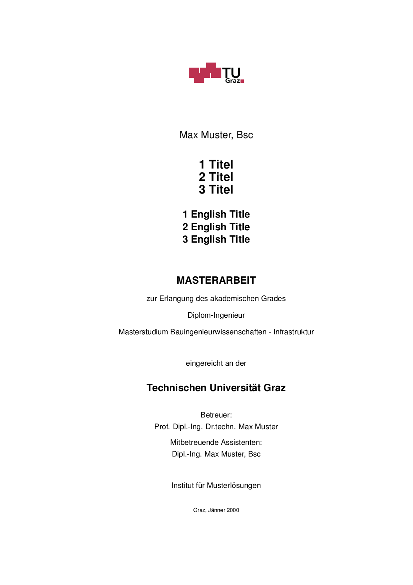
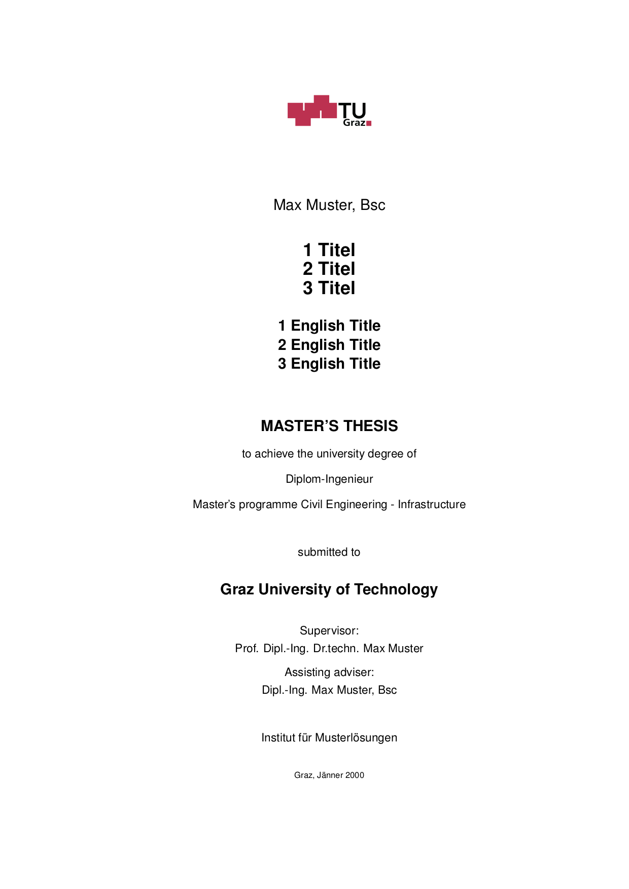

# Vorlage für die Masterarbeit am Institut für  Siedlungswasserwirtschaft an der TU Graz

Für die Erstellung der Arbeit in Latex sowie LyX

Hauptfokus war die Erstellung einer Latex-Vorlage die mit unserer MS-Word Vorlage übereinstimmt.

Ich empfehle jedoch stark LyX zu verwenden, da hier einige Arbeiten vereinfacht werden. 

Einige Vorteile sind zum Beispiel:

- Versionskontrolle
- Live Preview
- Latex im hintergrund
- Überarbeitungsmodus

Außerdem kann man LyX auf allen Betriebssystemen Downloaden.

https://www.lyx.org

----

**Eidesstattliche Erklärung bzw. Affidavit**

----

**Titelseite auf Deutsch**

----

**Titelseite auf Englisch**

----